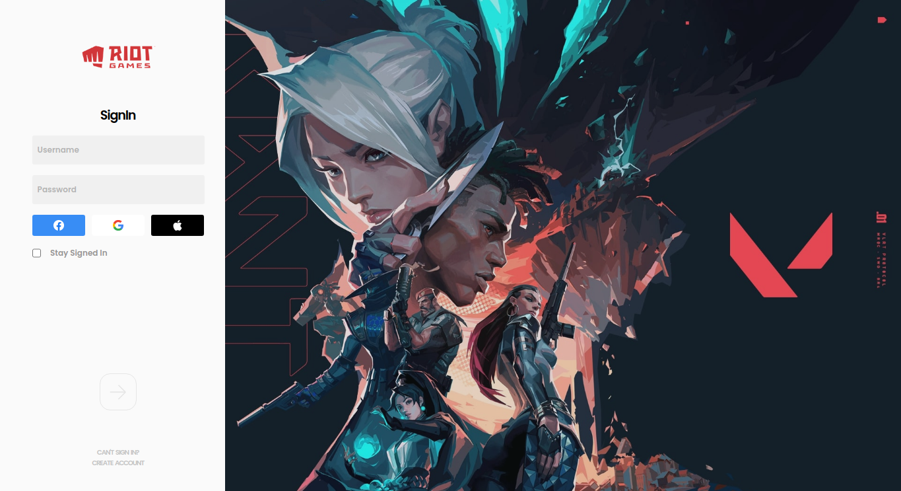

<p align="center">

<a href="https://github.com/RonaldGuilhermePDS/Valorant_Logo">

<p align="center">

</p>
</a>

<h2 align="center">Welcome!</h2>

<p align="center">
<a href="https://playvalorant.com">Valorant</a> Client Clone with <a
href="https://vuejs.org">Vue JS</a> Framework and <a
href="https://www.electronjs.org">Electron</a> Framework
</p>

<p align="center"><a href="https://github.com/RonaldGuilhermePDS/Valorant_Client_Clone/find/master"><strong><- Explore the docs -></strong></a></p>

<p align="center">
<a href="https://github.com/RonaldGuilhermePDS">Creator</a>
·
<a href="https://github.com/RonaldGuilhermePDS/Valorant_Client_Clone/issues">Report Bug</a>
·
<a href="https://github.com/RonaldGuilhermePDS/Valorant_Client_Clone/pulls">Request Feature</a>
</p>

<details open="open">
<summary>Table of Contents</summary>
<ol>
<li>
<a href="#about">About</a>
<ul>
<li><a href="#built-with">Built With</a></li>
</ul>
</li>
<li>
<a href="#getting-started">Getting Started</a>
<ul>
<li><a href="#installation">Installation</a></li>
</ul>
</li>
<li><a href="#screenshots">Screenshots</a></li>
<li><a href="#contributing">Contributing</a></li>
</ol>
</details>

## About

<a href="https://github.com/RonaldGuilhermePDS/Valorant_Client_Clone">Valorant Client Clone</a> is a **Project** that aims to clone the **Valorant Interface** to improve my **Skills**. 

## Built With

* [Node JS](https://github.com/nodejs/node)
* [Vue JS](https://vuejs.org)
* [Electron](https://www.electronjs.org)

## Getting Started

Follow the instructions to start the project without any problems.

## Installation

1. Clone the Repository
```sh
git clone https://github.com/RonaldGuilhermePDS/Valorant_Client_Clone.git
```
2. Install Packages
```sh
npm install or yarn install
```
3. Run
```sh
npm run electron:serve or yarn run electron:serve
```

## Screenshots

SigninScreen



## Contributing

Contributions are what make the open source community such an amazing place to be learn, inspire, and create. Any contributions you make are **greatly appreciated**.

1. Fork the Project
2. Create your Feature Branch (`git checkout -b feature/AmazingFeature`)
3. Commit your Changes (`git commit -m 'Add some AmazingFeature'`)
4. Push to the Branch (`git push origin feature/AmazingFeature`)
5. Open a Pull Request
